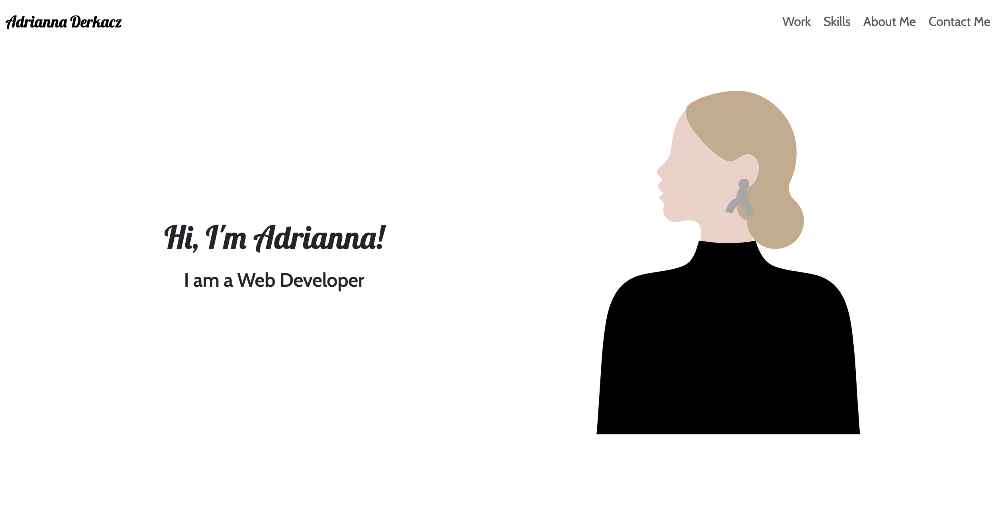

# Bootstrap Portfolio
## Bootcamp: Module 3 Challenge
Welcome to my Bootstrap portfolio project! This portfolio showcases my journey as a web developer, highlighting my skills in front-end development, UX/UI design, and my passion for creating intuitive, user-friendly websites and applications. Built with Bootstrap, this project leverages the framework's responsive features to ensure a seamless viewing experience across all devices.

## Table of Contents
- [Installation](#installation)
- [Page](#page)
- [Features](#features)
- [Credits](#credits)
- [License](#license)

## Installation
N/A

## Page
https://adriannaderkacz.github.io/bootstrap-portfolio/

## Features
- **Responsive Design:** Utilizes Bootstrap's grid system and responsive utilities to create a layout that adjusts beautifully to any screen size, from mobile phones to desktop monitors.
- **Dynamic Typing Effect:** A captivating typing effect in the hero section introduces me and my core skills in an engaging way, making the first impression memorable.
- **Portfolio Section:** Demonstrates my work through a grid of project cards, each detailing a project with options to view more about the project. This section is designed to be easily updated as my portfolio grows.
- **Skills Display:** A dedicated section to showcase my expertise in various technologies, particularly focusing on front-end development and UX/UI design.
- **Contact Form:** An interactive section for visitors to reach out to me, featuring a dynamic weather dashboard to display real-time weather conditions and forecasts for various cities, enhancing user interaction and engagement.
- **Accessibility and Performance:** Prioritizes accessibility standards and optimal performance to ensure that the site is user-friendly for everyone.

## Credits
I utilized the documentation from [Bootstrap](https://getbootstrap.com/) to successfully complete this challenge.

## License
MIT License

Copyright (c) [2024] [AdriannaDerkacz]

Permission is hereby granted, free of charge, to any person obtaining a copy
of this software and associated documentation files (the "Software"), to deal in the Software without restriction, including without limitation the rights to use, copy, modify, merge, publish, distribute, sublicense, and/or sell copies of the Software, and to permit persons to whom the Software is
furnished to do so, subject to the following conditions:

The above copyright notice and this permission notice shall be included in all copies or substantial portions of the Software.

THE SOFTWARE IS PROVIDED "AS IS", WITHOUT WARRANTY OF ANY KIND, EXPRESS OR
IMPLIED, INCLUDING BUT NOT LIMITED TO THE WARRANTIES OF MERCHANTABILITY,
FITNESS FOR A PARTICULAR PURPOSE AND NONINFRINGEMENT. IN NO EVENT SHALL THE
AUTHORS OR COPYRIGHT HOLDERS BE LIABLE FOR ANY CLAIM, DAMAGES OR OTHER
LIABILITY, WHETHER IN AN ACTION OF CONTRACT, TORT OR OTHERWISE, ARISING FROM, OUT OF OR IN CONNECTION WITH THE SOFTWARE OR THE USE OR OTHER DEALINGS IN THE SOFTWARE.
